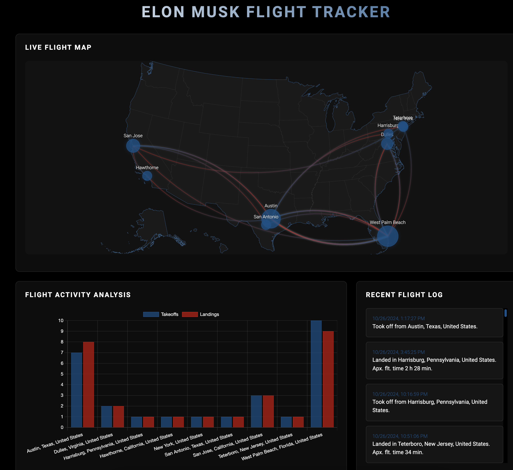

# Elon Tracker

A real-time web application that tracks and visualizes the location data of Elon Musk's private jet. This project uses publicly available flight data to create an interactive map showing the jet's current location, flight history, and travel patterns.



## Features
- 🛩️ Real-time tracking of jet location


## Installation & Setup

1. Clone the repository
```bash
git clone https://github.com/yourusername/elon-tracker.git
cd elon-tracker
```

2. Install dependencies
```bash
pip install -r requirements.txt
```

3. How to run
```bash
python app.py
``` 

